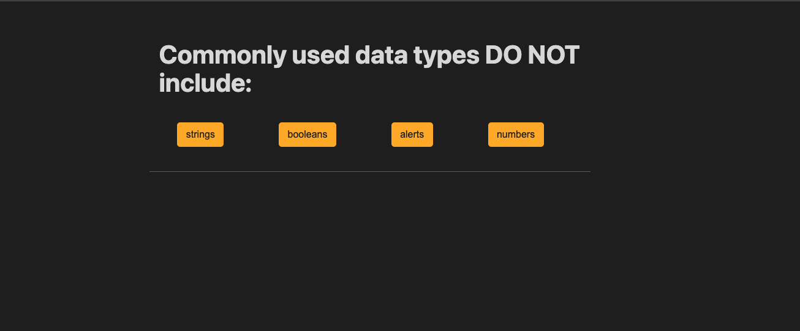

# Code Quiz Web API

## Table of Contents

[Description](#description)
[Visuals](#visuals)

## Description
[Link to Live Site]()

The code quiz web API is a functioning quiz on the fundamentals of JavaScript. When you click the start button, you are presented with the first question. When you answer the question, an alert tells you if you are right or wrong. Then you are presented with a new question until the quiz ends. Unfortunately, I was unable to code the timer or the highscores in time to submit with the extension that I asked for. I will continue to polish the API and resubmit.

## Visuals

